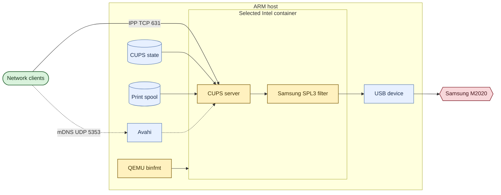

# Samsung M2020 CUPS container

Runs Samsung's proprietary SPL3 filter in a CUPS container. Two image variants are provided because the Samsung archive contains Intel binaries only:

| Directory | Container platform | Driver | Recommended host |
| --- | --- | --- | --- |
| `x86_64/` | `linux/amd64` | Samsung x86-64 | AMD64, or ARM64 with QEMU |
| `x86/` | `linux/386` | Samsung i386 | 32-bit ARM with QEMU |

The `x86/` variant uses Debian 12 because the current Ubuntu image is not published for `linux/386`. The Samsung i386 filter has been verified to load with Debian 12's current 32-bit CUPS libraries.

## Architecture



At runtime, `/dev/bus/usb` and two named CUPS volumes are mounted into the selected container. Host networking exposes CUPS on TCP port 631. Avahi stays on the host and advertises the queue over mDNS/DNS-SD.

## Common preparation

Install Docker Engine with the Compose plugin and install Avahi on the host. Stop the host CUPS service so it does not claim the printer or TCP port 631:

```sh
sudo apt install avahi-daemon avahi-utils
sudo systemctl disable --now cups cups.socket cups.path
```

Download and verify the Samsung Unified Linux Driver in the repository root:

```sh
./download-driver.sh
```

The archive is proprietary and intentionally excluded from Git. Review its included license before redistribution.

Find the printer URI before stopping host CUPS, or temporarily start it to run:

```sh
lpinfo -v | grep 'usb://Samsung/M2020'
```

## 32-bit ARM hosts

Use the `x86/` variant on ARMv7 and other 32-bit ARM Docker hosts. It emulates the Samsung i386 filter and the complete Debian i386 container.

Install the `linux/386` emulator and verify that Docker can execute an i386 image:

```sh
sudo docker run --privileged --rm tonistiigi/binfmt --install 386
sudo docker run --rm --platform linux/386 debian:bookworm-slim uname -m
```

The verification command should print `i686` or another i386-family machine name.

Configure, build, and start the 32-bit image:

```sh
cp x86/.env.example x86/.env
sudo editor x86/.env
sudo docker compose --env-file x86/.env -f x86/compose.yaml build
sudo docker compose --env-file x86/.env -f x86/compose.yaml up -d
sudo install -m 0644 x86/avahi-samsung-m2020.service /etc/avahi/services/
sudo systemctl restart avahi-daemon
```

## AMD64 and ARM64 hosts

Use the `x86_64/` variant on a native AMD64 host. On ARM64, first install amd64 emulation:

```sh
sudo docker run --privileged --rm tonistiigi/binfmt --install amd64
```

Configure, build, and start the x86-64 image:

```sh
cp x86_64/.env.example x86_64/.env
sudo editor x86_64/.env
sudo docker compose --env-file x86_64/.env -f x86_64/compose.yaml build
sudo docker compose --env-file x86_64/.env -f x86_64/compose.yaml up -d
sudo install -m 0644 x86_64/avahi-samsung-m2020.service /etc/avahi/services/
sudo systemctl restart avahi-daemon
```

## Test printing

Set `variant` to `x86` or `x86_64`, matching the running container:

```sh
variant=x86
sudo docker compose --env-file "$variant/.env" -f "$variant/compose.yaml" exec cups lpstat -t
sudo docker compose --env-file "$variant/.env" -f "$variant/compose.yaml" exec cups \
    lp -d Samsung_M2020 /usr/share/cups/data/testprint
```

Clients can use `ipp://HOSTNAME.local:631/printers/Samsung_M2020`.

The downloader uses the [Samsung Download Center](https://downloadcenter.samsung.com/content/DR/201704/20170407143829533/uld_V1.00.39_01.17.tar.gz) and a pinned SHA-512 checksum. The [AUR packaging recipe](https://aur.archlinux.org/cgit/aur.git/plain/PKGBUILD?h=samsung-unified-driver) is a secondary reference for the upstream archive.
